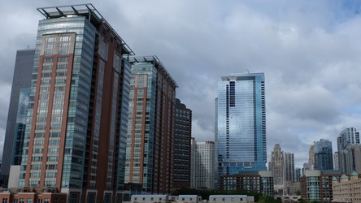
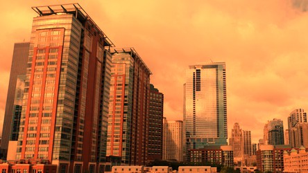
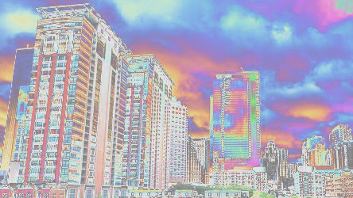
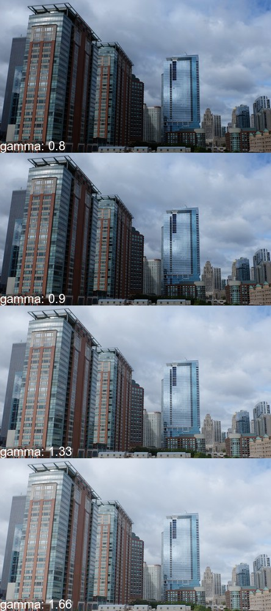
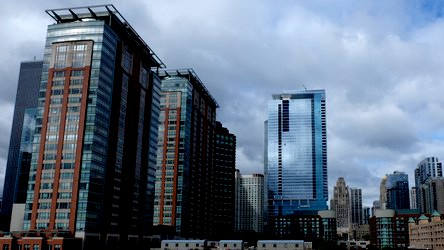

Color Enhancement
=================

.. _evaluate:

Evaluate Expression
-------------------

.. versionadded:: 0.4.1

Pixel channels can be manipulated by applying an arithmetic, relational, or
logical expression. See :const:`~wand.image.EVALUATE_OPS` for a list of valid
operations.

For example, when given image :file:`enhancement.jpg`:

We can reduce the amount of data in the blue channel by applying the
right-shift binary operator, and increase data in the right channel with
left-shift operator::

    from wand.image import Image

    with Image(filename='enhancement.jpg') as img:
        # B >> 1
        img.evaluate(operator='rightshift', value=1, channel='blue')
        # R << 1
        img.evaluate(operator='leftshift', value=1, channel='red')

.. _function:

Function Expression
-------------------

.. versionadded:: 0.4.1

Similar to :meth:`~wand.image.BaseImage.evaluate()`,
:meth:`~wand.image.BaseImage.function()` applies a multi-argument function to
pixel channels. See :const:`~wand.image.FUNCTION_TYPES` for a list of available
function formulas.

For example, when given image :file:`enhancement.jpg`:

We can apply a **Sinusoid** function with the following::

    from wand.image import Image

    with Image(filename='enhancement.jpg') as img:
        frequency = 3
        phase_shift = -90
        amplitude = 0.2
        bias = 0.7
        img.function('sinusoid', [frequency, phase_shift, amplitude, bias])

.. _gamma:

Gamma
-----

.. versionadded:: 0.4.1

Gamma correction allows you to adjust the luminance of an image. Resulting
pixels are defined as ``pixel^(1/gamma)``. The value of ``gamma`` is
typically between 0.8 & 2.3 range, and value of 1.0 will not affect the
resulting image.

The :meth:`~wand.image.Image.level()` method can also adjust ``gamma`` value.

For example, when given image :file:`enhancement.jpg`:

We can step through 4 pre-configured gamma correction values with the following::

    from wand.image import Image

    with Image(filename='enhancement.jpg') as img_src:
        for Y in [0.8, 0.9, 1.33, 1.66]:
            with Image(img_src) as img_cpy:
                img_cpy.gamma(Y)

.. _level:

Level
-----

.. versionadded:: 0.4.1

Black & white boundaries of an image can be controlled with
:meth:`~wand.image.Image.level()` method. Similar to the
:meth:`~wand.image.Image.gamma()` method, mid-point levels can be adjusted with
the ``gamma`` keyword argument.

The ``black`` and ``white`` point arguments are expecting values between 0.0 &
1.0 which represent percentages.

For example, when given image :file:`enhancement.jpg`:

We can adjust the level range between 20% & 90% with slight mid-range increase::

    from wand.image import Image

    with Image(filename='enhancement.jpg') as img:
        img.level(0.2, 0.9, gamma=1.1)
        img.save(filename='enhancement-level.jpg')

