.. _distort:

Distortion
==========

ImageMagick provides several ways to distort an image by applying various
transformations against user-supplied arguments. In Wand, the method
:meth:`Image.distort <wand.image.BaseImage.distort>` is used, and follows a
basic function signature of::

    with Image(...) as img:
        img.distort(method, arguments)

Where ``method`` is a string provided by :const:`~wand.image.DISTORTION_METHODS`,
and ``arguments`` is a list of doubles. Each ``method`` parses the ``arguments``
list differently. For example::

    # Arc can have a minimum of 1 argument
    img.distort('arc', (degree, ))
    # Affine 3-point will require 6 arguments
    points = (x1, y1, x2, y2,
              x3, y3, x4, y4,
              x5, y5, x6, y6)
    img.distort('affine', points)

A more complete & detailed overview on distortion can be found in `Distorting
Images`__ usage article by Anthony Thyssen.

__ https://www.imagemagick.org/Usage/distorts/

Controlling Resulting Images
----------------------------

Virtual Pixels
''''''''''''''

When performing distortion on raster images, the resulting image often includes
pixels that are outside original bounding raster. These regions are referred to
as vertical pixels, and can be controlled by setting
:attr:`Image.virtual_pixel <wand.image.BaseImage.virtual_pixel>` to any value
defined in :const:`~wand.image.VIRTUAL_PIXEL_METHOD`.

Virtual pixels set to ``'transparent'``, ``'black'``, or ``'white'`` are the
most common, but many users prefer use the existing background color.

.. code-block:: python

    with Image(filename='rose:') as img:
        img.resize(140, 92)
        img.background_color = img[70, 46]
        img.virtual_pixel = 'background'
        img.distort('arc', (60, ))

Other :attr:`~wand.image.BaseImage.virtual_pixel` values can create special
effects.

==================  =======
Virtual Pixel       Example
------------------  -------
``dither``          .. image:: ../_images/distort-arc-dither.png
``edge``            .. image:: ../_images/distort-arc-edge.png
``mirror``          .. image:: ../_images/distort-arc-mirror.png
``random``          .. image:: ../_images/distort-arc-random.png
``tile``            .. image:: ../_images/distort-arc-tile.png
==================  =======

Matte Color
'''''''''''

Some distortion transitions can not be calculated in the virtual-pixel space.
Either being invalid, or **NaN** (not-a-number). You can define how such
a pixel should be represented by setting the
:attr:`Image.matte_color <wand.image.BaseImage.matte_color>` property.

.. code-block:: python

    from wand.color import Color
    from wand.image import Image

    with Image(filename='rose:') as img:
        img.resize(140, 92)
        img.matte_color = Color('ORANGE')
        img.virtual_pixel = 'tile'
        args = (0, 0, 30, 60, 140, 0, 110, 60,
                0, 92, 2, 90, 140, 92, 138, 90)
        img.distort('perspective', args)

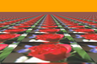

Rendering Size
''''''''''''''

Setting the ``'distort:viewport'`` artifact allows you to define the size, and
offset of the resulting image::

    img.artifacts['distort:viewport'] = '300x200+50+50'

Setting the ``'distort:scale'`` artifact will resizing the final image::

    img.artifacts['distort:scale'] = '75%'

Affine
------

Affine distortion performs a shear operation. The arguments are similar to
perspective, but only need a pair of 3 points, or 12 real numbers.

.. parsed-literal::

    src1\ :sub:`x`, src1\ :sub:`y`, dst1\ :sub:`x`, dst1\ :sub:`y`,
    src2\ :sub:`x`, src2\ :sub:`y`, dst2\ :sub:`x`, dst2\ :sub:`y`,
    src3\ :sub:`x`, src3\ :sub:`y`, dst3\ :sub:`x`, dst3\ :sub:`y`,
    ...

For example::

    from wand.color import Color
    from wand.image import Image

    with Image(filename='rose:') as img:
        img.resize(140, 92)
        img.background_color = Color('skyblue')
        img.virtual_pixel = 'background'
        args = (
            10, 10, 15, 15,  # Point 1: (10, 10) => (15,  15)
            139, 0, 100, 20, # Point 2: (139, 0) => (100, 20)
            0, 92, 50, 80    # Point 3: (0,  92) => (50,  80)
        )
        img.distort('affine', args)

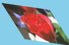

Affine Projection
-----------------

Affine projection is identical to `Scale Rotate Translate`, but requires exactly
6 real numbers for the distortion arguments.

.. parsed-literal::

    Scale\ :sub:`x`, Rotate\ :sub:`x`, Rotate\ :sub:`y`, Scale\ :sub:`y`, Translate\ :sub:`x`, Translate\ :sub:`y`

For example::

    from collections import namedtuple
    from wand.color import Color
    from wand.image import Image

    Point = namedtuple('Point', ['x', 'y'])

    with Image(filename='rose:') as img:
        img.resize(140, 92)
        img.background_color = Color('skyblue')
        img.virtual_pixel = 'background'
        rotate = Point(0.1, 0)
        scale = Point(0.7, 0.6)
        translate = Point(5, 5)
        args = (
            scale.x, rotate.x, rotate.y,
            scale.y, translate.x, translate.y
        )
        img.distort('affine_projection', args)

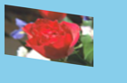

Arc
---

Arc distortion curves the image around the center point of an image. The
arguments are:

.. parsed-literal::

    ArcAngle, RotateAngle, TopRadius, BottomRadius

Where `ArcAngle` is the only required arguments, and the rest are optional.

For example::

    from wand.color import Color
    from wand.image import Image

    with Image(filename='rose:') as img:
        img.resize(140, 92)
        img.background_color = Color('skyblue')
        img.virtual_pixel = 'background'
        args = (
            270,  # ArcAngle
            45,   # RotateAngle
        )
        img.distort('arc', args)

Barrel
------

Barrel distortion attempts to correct spherical distortion caused by camera
lenses. It operates with four constant coefficient values `A`, `B`, `C`, & `D`
mapped to the images EXIF meta-data. Usually camera, lens, and zoom attributes.
The equation for ``barrel`` distortion is:

.. math:: {R}_{src} = r * \left( A * r^3 + B * r^2 + C * r + D \right)

Where ``r`` is the destination radius. The arguments for the distortion are:

.. parsed-literal::

    A B C D X Y

Where ``X`` & ``Y`` are optional center coordinates.

For example::

    from wand.color import Color
    from wand.image import Image

    with Image(filename='rose:') as img:
        img.resize(140, 92)
        img.background_color = Color('skyblue')
        img.virtual_pixel = 'background'
        args = (
            0.2,  # A
            0.0,  # B
            0.0,  # C
            1.0,  # D
        )
        img.distort('barrel', args)

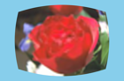

Barrel Inverse
--------------
The barrel inverse distortion has the same arguments as the barrel distortion,
but performs a different equation.

.. math:: {R}_{src} = { r \over \left( A * r^3 + B * r^2 + C * r + D \right) }

It does not reverse, or undo, the effects of the barrel distortion.

For example::

    from wand.color import Color
    from wand.image import Image

    with Image(filename='rose:') as img:
        img.resize(140, 92)
        img.background_color = Color('skyblue')
        img.virtual_pixel = 'background'
        args = (
            0.0,   # A
            0.0,   # B
            -0.5,  # C
            1.5,   # D
        )
        img.distort('barrel_inverse', args)

.. image:: ../_images/distort-barrel-inverse.png

Bilinear
--------

The bilinear distortion is similar to perspective distortion, but evenly
distributes pixels rather than compress & reduce shrinking areas. This
means that shrunk areas of the image will appear flat with bilinear as opposed
to farther away. The arguments are:

.. parsed-literal::

    src1\ :sub:`x`, src1\ :sub:`y`, dst1\ :sub:`x`, dst1\ :sub:`y`,
    src2\ :sub:`x`, src2\ :sub:`y`, dst2\ :sub:`x`, dst2\ :sub:`y`,
    src3\ :sub:`x`, src3\ :sub:`y`, dst3\ :sub:`x`, dst3\ :sub:`y`,
    src4\ :sub:`x`, src4\ :sub:`y`, dst4\ :sub:`x`, dst4\ :sub:`y`,
    ...

Unlike other inverse methods, bilinear distortion effects are directional.
Meaning you can undo a distortion previously applied. For example::

    from itertools import chain
    from wand.color import Color
    from wand.image import Image

    with Image(filename='rose:') as img:
        img.resize(140, 92)
        img.background_color = Color('skyblue')
        img.virtual_pixel = 'background'
        source_points = (
            (0, 0),
            (140, 0),
            (0, 92),
            (140, 92)
        )
        destination_points = (
            (14, 4.6),
            (126.9, 9.2),
            (0, 92),
            (140, 92)
        )
        order = chain.from_iterable(zip(source_points, destination_points))
        arguments = list(chain.from_iterable(order))
        img.distort('bilinear_forward', arguments)

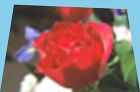

And then reverted with by swapping the destination with source coordinates,
and using ``'bilinear_reverse'``::

        order = chain.from_iterable(zip(destination_points, source_points))
        arguments = list(chain.from_iterable(order))
        img.distort('bilinear_reverse', arguments)

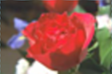

Cylinder & Plane
----------------

Cylinder 2 plane is a radial projection to correct common field of
vision (fov) distortions. The arguments are:

.. parsed-literal::

    FovAngle, CenterX, CenterY, FovOutput, DestCenterX, DestCenterY

Where only the first argument is required, and the rest are optional.
The `FovAngle` value can be roughly calculated by:

.. math:: {FovAngle} = {{LensFocalLength} \over {FilmWidth}} * { 180 \over \pi }

The ``'plane_2_cylinder'`` is the inverted behavior. The arguments are:

.. parsed-literal::

    FovAngle, CenterX, CenterY

For (a rather poor) example::

    import math
    from wand.color import Color
    from wand.image import Image

    with Image(filename='rose:') as img:
        img.resize(140, 92)
        img.background_color = Color('skyblue')
        img.virtual_pixel = 'background'
        lens = 60
        film = 35
        args = (
            lens/film * 180/math.pi,
        )
        img.distort('plane_2_cylinder', args)

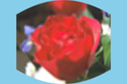

And the inverse::

        img.distort('cylinder_2_plane', args)

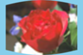

Perspective
-----------

Perspective distortion requires 4 pairs of points which is a total of 16 doubles.
The order of the ``arguments`` are groups of source & destination coordinate
pairs.

.. parsed-literal::

    src1\ :sub:`x`, src1\ :sub:`y`, dst1\ :sub:`x`, dst1\ :sub:`y`,
    src2\ :sub:`x`, src2\ :sub:`y`, dst2\ :sub:`x`, dst2\ :sub:`y`,
    src3\ :sub:`x`, src3\ :sub:`y`, dst3\ :sub:`x`, dst3\ :sub:`y`,
    src4\ :sub:`x`, src4\ :sub:`y`, dst4\ :sub:`x`, dst4\ :sub:`y`,
    ...

For example::

    from itertools import chain
    from wand.color import Color
    from wand.image import Image

    with Image(filename='rose:') as img:
        img.resize(140, 92)
        img.background_color = Color('skyblue')
        img.virtual_pixel = 'background'
        source_points = (
            (0, 0),
            (140, 0),
            (0, 92),
            (140, 92)
        )
        destination_points = (
            (14, 4.6),
            (126.9, 9.2),
            (0, 92),
            (140, 92)
        )
        order = chain.from_iterable(zip(source_points, destination_points))
        arguments = list(chain.from_iterable(order))
        img.distort('perspective', arguments)

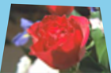

Polar & Depolar
---------------

Polar distortion is similar to arc distort method, but does not attempt to
preserve aspect ratios.

.. parsed-literal::

    Radius\ :sub:`max`, Radius\ :sub:`min`, Center\ :sub:`x`, Center\ :sub:`y`, Angle\ :sub:`start`, Angle\ :sub:`end`

All the arguments are optional, and an argument of ``0`` will use the distance
of the center to the closet edge as the default radius.

For example::

    from wand.image import Image

    with Image(filename='rose:') as img:
        img.resize(140, 92)
        img.virtual_pixel = 'black'
        img.distort('polar', (0,))

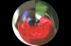

For depolar distortion, the arguments are the same. However to revert the image
previously distorted with nearest edge (argument ``0``), use ``-1`` for
ImageMagick to calculate the radius distance from the middle to the farthest
edge.

For example::

    from wand.image import Image

    with Image(filename='distort-polar.png') as img:
        img.virtual_pixel = 'horizontal_tile'
        img.distort('depolar', (-1,))

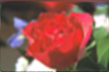

Polynomial
----------

Polynomial distortion requires at least four sets of coordinates & control
points, and will perform a standard polynomial equation. However, the first
distortion argument is reserved to define the ``Order``, or ``Complexity``
of the two dimensional equation.

.. parsed-literal::

    Order, src1\ :sub:`x`, src1\ :sub:`y`, dst1\ :sub:`x`, dst1\ :sub:`y`,
           src2\ :sub:`x`, src2\ :sub:`y`, dst2\ :sub:`x`, dst2\ :sub:`y`,
           src3\ :sub:`x`, src3\ :sub:`y`, dst3\ :sub:`x`, dst3\ :sub:`y`,
           src4\ :sub:`x`, src4\ :sub:`y`, dst4\ :sub:`x`, dst4\ :sub:`y`,
           ...

For example::

    from collections import namedtuple
    from wand.color import Color
    from wand.image import Image

    Point = namedtuple('Point', ['x', 'y', 'i', 'j'])

    with Image(filename='rose:') as img:
        img.resize(140, 92)
        img.background_color = Color('skyblue')
        img.virtual_pixel = 'background'
        order = 1.5
        alpha = Point(0, 0, 26, 0)
        beta = Point(139, 0, 114, 23)
        gamma = Point(139, 91, 139, 80)
        delta = Point(0, 92, 0, 78)
        args = (
            order,
            alpha.x, alpha.y, alpha.i, alpha.j,
            beta.x, beta.y, beta.i, beta.j,
            gamma.x, gamma.y, gamma.i, gamma.j,
            delta.x, delta.y, delta.i, delta.j,
        )
        img.distort('polynomial', args)

Scale Rotate Translate
----------------------

A more common form of distortion, the method ``'scale_rotate_translate'`` can
be controlled by the total number of arguments.

The total arguments dictate the following order.

===============  ==============
Total Arguments  Argument Order
---------------  --------------
 1                Angle
 2                Scale, Angle
 3                X, Y, Angle
 4                X, Y, Scale, Angle
 5                X, Y, ScaleX, ScaleY, Angle
 6                X, Y, Scale, Angle, NewX, NewY
 7                X, Y, ScaleX, ScaleY, Angle, NewX, NewY
===============  ==============

For example...

A single argument would be treated as an angle::

    from wand.color import Color
    from wand.image import Image

    with Image(filename='rose:') as img:
        img.resize(140, 92)
        img.background_color = Color('skyblue')
        img.virtual_pixel = 'background'
        angle = 90.0
        img.distort('scale_rotate_translate', (angle,))

Two arguments would be treated as a scale & angle::

    with Image(filename='rose:') as img:
        img.resize(140, 92)
        img.background_color = Color('skyblue')
        img.virtual_pixel = 'background'
        angle = 90.0
        scale = 0.5
        img.distort('scale_rotate_translate', (scale, angle,))

And three arguments would describe the origin of rotation::

    with Image(filename='rose:') as img:
        img.resize(140, 92)
        img.background_color = Color('skyblue')
        img.virtual_pixel = 'background'
        x = 80
        y = 60
        angle = 90.0
        img.distort('scale_rotate_translate', (x, y, angle,))

... and so forth.

Shepards
--------

Shepard's distortion moves (or smudges) a given source point to a destination
coordinate. The arguments are:

.. parsed-literal::

    src1\ :sub:`x`, src1\ :sub:`y`, dst1\ :sub:`x`, dst1\ :sub:`y`,
    src2\ :sub:`x`, src2\ :sub:`y`, dst2\ :sub:`x`, dst2\ :sub:`y`,
    ...

The size, or inverse weighted distance, of the source point can be controlled
by defining ``shepards:power`` artifact.

For example::

    from collections import namedtuple
    from wand.color import Color
    from wand.image import Image

    Point = namedtuple('Point', ['x', 'y', 'i', 'j'])

    with Image(filename='rose:') as img:
        img.resize(140, 92)
        img.background_color = Color('skyblue')
        img.virtual_pixel = 'background'
        img.artifacts['distort:viewport'] = "160x112-10+10"
        img.artifacts['shepards:power'] = "4.0"
        alpha = Point(0, 0, 30, 15)
        beta = Point(70, 46, 60, 70)
        args = (
            *alpha,
            *beta
        )
        img.distort('shepards', args)

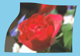
