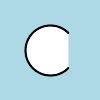
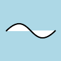
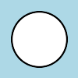
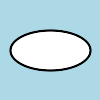
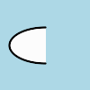
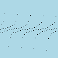
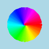

Drawing
=======

.. versionadded:: 0.3.0

The :mod:`wand.drawing` module provides some basic drawing functions.
:class:`wand.drawing.Drawing` object buffers instructions for drawing
shapes into images, and then it can draw these shapes into zero or more
images.

It's also callable and takes an :class:`~wand.image.Image` object::

    from wand.drawing import Drawing
    from wand.image import Image

    with Drawing() as draw:
        # does something with ``draw`` object,
        # and then...
        with Image(filename='wandtests/assets/beach.jpg') as image:
            draw(image)

.. _draw-arc:

Arc
---

.. versionadded:: 0.4.0

Arcs can be drawn by using :meth:`~wand.drawing.Drawing.arc()` method. You'll
need to define three pairs of (x, y) coordinates. First & second pair of
coordinates will be the minimum bounding rectangle, and the last pair define
the starting & ending degree.

An example::

    from wand.image import Image
    from wand.drawing import Drawing
    from wand.color import Color

    with Drawing() as draw:
        draw.stroke_color = Color('black')
        draw.stroke_width = 2
        draw.fill_color = Color('white')
        draw.arc(( 25, 25),  # Stating point
                 ( 75, 75),  # Ending point
                 (135,-45))  # From bottom left around to top right
        with Image(width=100,
                   height=100,
                   background=Color('lightblue')) as img:
            draw.draw(img)
            img.save(filename='draw-arc.gif')

.. _draw-bezier:

Bezier
------

.. versionadded:: 0.4.0

You can draw bezier curves using :meth:`~wand.drawing.Drawing.bezier()` method.
This method requires at least four points to determine a bezier curve. Given
as a list of (x, y) coordinates. The first & last pair of coordinates are
treated as start & end, and the second & third pair of coordinates act as
controls.

For example::

    from wand.image import Image
    from wand.drawing import Drawing
    from wand.color import Color

    with Drawing() as draw:
        draw.stroke_color = Color('black')
        draw.stroke_width = 2
        draw.fill_color = Color('white')
        points = [(10,50),  # Start point
                  (50,10),  # First control
                  (50,90),  # Second control
                  (90,50)]  # End point
        draw.bezier(points)
        with Image(width=100,
                   height=100,
                   background=Color('lightblue')) as image:
            draw(image)

Control width & color of curve with the drawing properties:

- :attr:`~wand.drawing.Drawing.stroke_color`
- :attr:`~wand.drawing.Drawing.stroke_width`

.. _draw-circle:

Circle
------

.. versionadded:: 0.4.0

You can draw circles using :meth:`~wand.drawing.Drawing.circle()` method.
Circles are drawn by defining two pairs of (x, y) coordinates. First coordinate
for the center "``origin``" point, and a second pair for the outer
``perimeter``. For example, the following code draws a circle in the middle of
the ``image``::

    from wand.image import Image
    from wand.drawing import Drawing
    from wand.color import Color

    with Drawing() as draw:
        draw.stroke_color = Color('black')
        draw.stroke_width = 2
        draw.fill_color = Color('white')
        draw.circle((50, 50), # Center point
                    (25, 25)) # Perimeter point
        with Image(width=100, height=100, background=Color('lightblue')) as image:
            draw(image)

.. _draw-color-and-matte:

Color & Matte
-------------

.. versionadded:: 0.4.0

You can draw with colors directly on the coordinate system of an image. Define
which color to set by setting :attr:`~wand.drawing.Drawing.fill_color`.
The behavior of :meth:`~wand.drawing.Drawing.color()` is controlled by setting
one of :const:`~wand.drawing.PAINT_METHOD_TYPES` paint methods.

 - ``'point'`` alters a single pixel.
 - ``'replace'`` swaps on color for another. Threshold is influenced by
   :attr:`~wand.image.Image.fuzz`.
 - ``'floodfill'`` fills area of a color influenced by
   :attr:`~wand.image.Image.fuzz`.
 - ``'filltoborder'`` fills area of a color until border defined by
   :attr:`~wand.drawing.Drawing.border_color`.
 - ``'reset'`` replaces the whole image to a single color.

Example fill all to green boarder::

    from wand.drawing import Drawing
    from wand.color import Color

    with Drawing() as draw:
        draw.border_color = Color('green')
        draw.fill_color = Color('blue')
        draw.color(15, 25, 'filltoborder')

The :meth:`~wand.drawing.Drawing.matte()` method is identical to
the :meth:`~wand.drawing.Drawing.color()`
method above, but alters the alpha channel of the color area selected. Colors
can be manipulated, but not replaced.

::

    with Drawing() as draw:
        draw.fill_color = None  # or Color('none')
        draw.matte(15, 25, 'floodfill')

.. _draw-composite:

Composite
---------

.. versionadded:: 0.4.0

Similar to :meth:`~wand.image.BaseImage.composite_channel()`, this
:meth:`~wand.drawing.Drawing.composite()` method will render a given image on
top of the drawing subject image following the
:const:`~wand.image.COMPOSITE_OPERATORS` options. An compositing image must be
given with a destination ``top``, ``left``, ``width``, and ``height`` values.

::

    from wand.image import Image, COMPOSITE_OPERATORS
    from wand.drawing import Drawing
    from wand.display import display

    wizard = Image(filename='wizard:')
    rose = Image(filename='rose:')

    for o in COMPOSITE_OPERATORS:
      w = wizard.clone()
      r = rose.clone()
      with Drawing() as draw:
        draw.composite(operator=o, left=175, top=250,
                       width=r.width, height=r.height, image=r)
        draw(w)
        display(w)

.. _draw-ellipse:

Ellipse
-------

.. versionadded:: 0.4.0

Ellipse can be drawn by using the :meth:`~wand.drawing.Drawing.ellipse()` method.
Like drawing circles, the ellipse requires a ``origin`` point, however, a pair
of (x, y) ``radius`` are used in relationship to the ``origin`` coordinate. By
default a complete "closed" ellipse is drawn. To draw a partial ellipse, provide
a pair of starting & ending degrees as the third parameter.

An example of a full ellipse::

    from wand.image import Image
    from wand.drawing import Drawing
    from wand.color import Color
    
    with Drawing() as draw:
        draw.stroke_color = Color('black')
        draw.stroke_width = 2
        draw.fill_color = Color('white')
        draw.ellipse((50, 50), # Origin (center) point
                     (40, 20)) # 80px wide, and 40px tall
        with Image(width=100, height=100, background=Color('lightblue')) as image:
            draw(image)

Same example as above, but with a half-partial ellipse defined by the third
parameter::

    draw.ellipse((50, 50), # Origin (center) point
                 (40, 20), # 80px wide, and 40px tall
                 (90,-90)) # Draw half of ellipse from bottom to top

.. _draw-lines:

Lines
-----

You can draw lines using :meth:`~wand.drawing.Drawing.line()` method.
It simply takes two (x, y) coordinates for start and end of a line.
For example, the following code draws a diagonal line into the ``image``::

    draw.line((0, 0), image.size)
    draw(image)

Or you can turn this diagonal line upside down::

    draw.line((0, image.height), (image.width, 0))
    draw(image)

The line color is determined by :attr:`~wand.drawing.Drawing.fill_color`
property, and you can change this of course.  The following code draws
a red diagonal line into the ``image``::

    from wand.color import Color

    with Color('red') as color:
        draw.fill_color = color
        draw.line((0, 0), image.size)
        draw(image)

.. _draw-paths:

Paths
-----

.. versionadded:: 0.4.0

Paths can be drawn by using any collection of path functions between
:meth:`~wand.drawing.Drawing.path_start()` and
:meth:`~wand.drawing.Drawing.path_finish()` methods. The available path functions
are:

- :meth:`~wand.drawing.Drawing.path_close()` draws a path from last point to first.
- :meth:`~wand.drawing.Drawing.path_curve()` draws a cubic bezier curve.
- :meth:`~wand.drawing.Drawing.path_curve_to_quadratic_bezier()` draws a quadratic bezier curve.
- :meth:`~wand.drawing.Drawing.path_elliptic_arc()` draws an elliptical arc.
- :meth:`~wand.drawing.Drawing.path_horizontal_line()` draws a horizontal line.
- :meth:`~wand.drawing.Drawing.path_line()` draws a line path.
- :meth:`~wand.drawing.Drawing.path_move()` adjust current point without drawing.
- :meth:`~wand.drawing.Drawing.path_vertical_line()` draws a vertical line.

Each path method expects a destination point, and will draw from the current
point to the new point. The destination point will become the new current point
for the next applied path method. Destination points are given in the
form of (``x``, ``y``) coordinates to the ``to`` parameter, and can by relative
or absolute to the current point by setting the ``relative`` flag. The
:meth:`~wand.drawing.Drawing.path_curve()` and
:meth:`~wand.drawing.Drawing.path_curve_to_quadratic_bezier()` expect
additional ``control`` points, and can complement previous drawn curves by
setting a ``smooth`` flag. When the ``smooth`` flag is set to ``True`` the first
control point is assumed to be the reflection of the last defined control point.

For example::

    from wand.image import Image
    from wand.drawing import Drawing
    from wand.color import Color
    
    with Drawing() as draw:
        draw.stroke_width = 2
        draw.stroke_color = Color('black')
        draw.fill_color = Color('white')
        draw.path_start()
        # Start middle-left
        draw.path_move(to=(10, 50))
        # Curve accross top-left to center
        draw.path_curve(to=(40, 0),
                        controls=[(10, -40), (30,-40)],
                        relative=True)
        # Continue curve accross bottom-right
        draw.path_curve(to=(40, 0),
                        controls=(30, 40),
                        smooth=True,
                        relative=True)
        # Line to top-right
        draw.path_vertical_line(10)
        # Diagonal line to bottom-left
        draw.path_line(to=(10, 90))
        # Close first & last points
        draw.path_close()
        draw.path_finish()
        with Image(width=100, height=100, background=Color('lightblue')) as image:
            draw(image)

.. image:: ../_images/draw-path.gif
   :alt: draw-path.gif

.. _draw-point:

Point
-----

.. versionadded:: 0.4.0

You can draw points by using :meth:`~wand.drawing.Drawing.point()` method.
It simply takes two ``x``, ``y`` arguments for the point coordinate.

The following example will draw points following a math function across a given
``image``::

    from wand.image import Image
    from wand.drawing import Drawing
    from wand.color import Color
    import math
    
    with Drawing() as draw:
        for x in xrange(0, 100):
            y = math.tan(x) * 4
            draw.point(x, y + 50)
        with Image(width=100, height=100, background=Color('lightblue')) as image:
            draw(image)

Color of the point can be defined by setting the following property

- :attr:`~wand.drawing.Drawing.fill_color`

.. _draw-polygon:

Polygon
-------

.. versionadded:: 0.4.0

Complex shapes can be created with the :meth:`~wand.drawing.Drawing.polygon()`
method. You can draw a polygon by given this method a list of points. Stroke
line will automatically close between first & last point.

For example, the following code will draw a triangle into the ``image``::

    from wand.image import Image
    from wand.drawing import Drawing
    from wand.color import Color

    with Drawing() as draw:
        draw.stroke_width = 2
        draw.stroke_color = Color('black')
        draw.fill_color = Color('white')
        points = [(25, 25), (75, 50), (25, 75)]
        draw.polygon(points)
        with Image(width=100, height=100, background=Color('lightblue')) as image:
            draw(image)

Control the fill & stroke with the following properties:

- :attr:`~wand.drawing.Drawing.stroke_color`
- :attr:`~wand.drawing.Drawing.stroke_dash_array`
- :attr:`~wand.drawing.Drawing.stroke_dash_offset`
- :attr:`~wand.drawing.Drawing.stroke_line_cap`
- :attr:`~wand.drawing.Drawing.stroke_line_join`
- :attr:`~wand.drawing.Drawing.stroke_miter_limit`
- :attr:`~wand.drawing.Drawing.stroke_opacity`
- :attr:`~wand.drawing.Drawing.stroke_width`
- :attr:`~wand.drawing.Drawing.fill_color`
- :attr:`~wand.drawing.Drawing.fill_opacity`
- :attr:`~wand.drawing.Drawing.fill_rule`

.. _draw-polyline:

Polyline
--------

.. versionadded:: 0.4.0

Identical to :meth:`~wand.drawing.Drawing.polygon()`, except
:meth:`~wand.drawing.Drawing.polyline()` will not close the stroke line
between the first & last point.

For example, the following code will draw a two line path on the ``image``::

    from wand.image import Image
    from wand.drawing import Drawing
    from wand.color import Color

    with Drawing() as draw:
        draw.stroke_width = 2
        draw.stroke_color = Color('black')
        draw.fill_color = Color('white')
        points = [(25, 25), (75, 50), (25, 75)]
        draw.polyline(points)
        with Image(width=100, height=100, background=Color('lightblue')) as image:
            draw(image)

Control the fill & stroke with the following properties:

- :attr:`~wand.drawing.Drawing.stroke_color`
- :attr:`~wand.drawing.Drawing.stroke_dash_array`
- :attr:`~wand.drawing.Drawing.stroke_dash_offset`
- :attr:`~wand.drawing.Drawing.stroke_line_cap`
- :attr:`~wand.drawing.Drawing.stroke_line_join`
- :attr:`~wand.drawing.Drawing.stroke_miter_limit`
- :attr:`~wand.drawing.Drawing.stroke_opacity`
- :attr:`~wand.drawing.Drawing.stroke_width`
- :attr:`~wand.drawing.Drawing.fill_color`
- :attr:`~wand.drawing.Drawing.fill_opacity`
- :attr:`~wand.drawing.Drawing.fill_rule`

.. _draw-push-pop:

Push & Pop
----------

.. versionadded:: 0.4.0

When working with complex vector graphics, you can use ImageMagick's internal
graphic-context stack to manage different styles & operations. The methods
:meth:`~wand.drawing.Drawing.push()`, :meth:`~wand.drawing.Drawing.push_clip_path()`,
:meth:`~wand.drawing.Drawing.push_defs()`, and :meth:`~wand.drawing.Drawing.push_pattern()`
are used to mark the beginning of a sub-routine. The clip path & pattern methods
take a name based identifier argument, and can be referenced at a latter point
with :attr:`~wand.drawing.Drawing.clip_path`, or
:meth:`~wand.drawing.Drawing.set_fill_pattern_url()` /
:meth:`~wand.drawing.Drawing.set_stroke_pattern_url()`
respectively. With stack management, :meth:`~wand.drawing.Drawing.pop()` is used
to mark the end of a sub-routine, and return the graphical context to its
pervious state before :meth:`~wand.drawing.Drawing.push()` was invoked.
Methods :meth:`~wand.drawing.Drawing.pop_clip_path()`,
:meth:`~wand.drawing.Drawing.pop_defs()`, and :meth:`~wand.drawing.Drawing.pop_pattern()`
exist to match there pop counterparts.

::

    from wand.color import Color
    from wand.image import Image
    from wand.drawing import Drawing
    from wand.compat import nested
    from math import cos, pi, sin

    with nested(Color('lightblue'),
                Color('transparent'),
                Drawing()) as (bg, fg, draw):
        draw.stroke_width = 3
        draw.fill_color = fg
        for degree in range(0, 360, 15):
            draw.push()  # Grow stack
            draw.stroke_color = Color('hsl({0}%, 100%, 50%)'.format(degree * 100 / 360))
            t = degree / 180.0 * pi
            x = 35 * cos(t) + 50
            y = 35 * sin(t) + 50
            draw.line((50, 50), (x, y))
            draw.pop()  # Restore stack
        with Image(width=100, height=100, background=Color('lightblue')) as img:
            draw(img)

.. _draw-rectangles:

Rectangles
----------

.. versionadded:: 0.3.6
.. versionchanged:: 0.4.0

If you want to draw rectangles use :meth:`~wand.drawing.Drawing.rectangle()`
method.  It takes ``left``/``top`` coordinate, and ``right``/``bottom``
coordinate, or ``width`` and ``height``.  For example, the following code
draws a square on the ``image``::

    draw.rectangle(left=10, top=10, right=40, bottom=40)
    draw(image)

Or using ``width`` and ``height`` instead of ``right`` and ``bottom``::

    draw.rectangle(left=10, top=10, width=30, height=30)
    draw(image)

Support for rounded corners was added in version 0.4.0. The ``radius`` argument
sets corner rounding. ::

    draw.rectangle(left=10, top=10, width=30, height=30, radius=5)
    draw(image)

Both horizontal & vertical can be set independently with
``xradius`` & ``yradius`` respectively. ::

    draw.rectangle(left=10, top=10, width=30, height=30, xradius=5, yradius=3)
    draw(image)

Note that the stoke and the fill are determined by the following properties:

- :attr:`~wand.drawing.Drawing.stroke_color`
- :attr:`~wand.drawing.Drawing.stroke_dash_array`
- :attr:`~wand.drawing.Drawing.stroke_dash_offset`
- :attr:`~wand.drawing.Drawing.stroke_line_cap`
- :attr:`~wand.drawing.Drawing.stroke_line_join`
- :attr:`~wand.drawing.Drawing.stroke_miter_limit`
- :attr:`~wand.drawing.Drawing.stroke_opacity`
- :attr:`~wand.drawing.Drawing.stroke_width`
- :attr:`~wand.drawing.Drawing.fill_color`
- :attr:`~wand.drawing.Drawing.fill_opacity`
- :attr:`~wand.drawing.Drawing.fill_rule`

.. _draw-texts:

Texts
-----

:class:`~wand.drawing.Drawing` object can write texts as well using its
:meth:`~wand.drawing.Drawing.text()` method.  It takes ``x`` and ``y``
coordinates to be drawn and a string to write::

    draw.font = 'wandtests/assets/League_Gothic.otf'
    draw.font_size = 40
    draw.text(image.width / 2, image.height / 2, 'Hello, world!')
    draw(image)

As the above code shows you can adjust several settings before writing texts:

- :attr:`~wand.drawing.Drawing.font`
- :attr:`~wand.drawing.Drawing.font_family`
- :attr:`~wand.drawing.Drawing.font_resolution`
- :attr:`~wand.drawing.Drawing.font_size`
- :attr:`~wand.drawing.Drawing.font_stretch`
- :attr:`~wand.drawing.Drawing.font_style`
- :attr:`~wand.drawing.Drawing.font_weight`
- :attr:`~wand.drawing.Drawing.gravity`
- :attr:`~wand.drawing.Drawing.text_alignment`
- :attr:`~wand.drawing.Drawing.text_antialias`
- :attr:`~wand.drawing.Drawing.text_decoration`
- :attr:`~wand.drawing.Drawing.text_direction`
- :attr:`~wand.drawing.Drawing.text_interline_spacing`
- :attr:`~wand.drawing.Drawing.text_interword_spacing`
- :attr:`~wand.drawing.Drawing.text_kerning`
- :attr:`~wand.drawing.Drawing.text_under_color`
