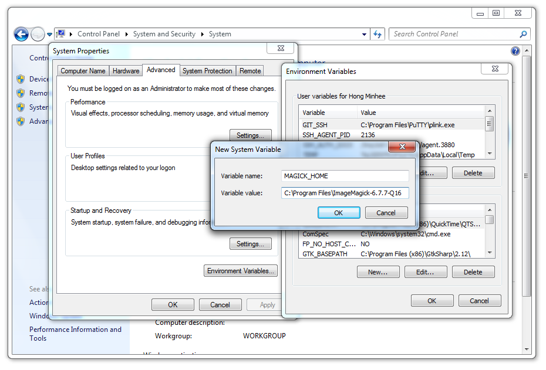

Installation
============

Wand itself can be installed from PyPI_ using :program:`pip`:

.. sourcecode:: console

   $ pip install Wand

Wand is a Python binding of ImageMagick_, so you have to install it as well:

- :ref:`Debian/Ubuntu <install-imagemagick-debian>`
- :ref:`Fedora/CentOS <install-imagemagick-redhat>`
- :ref:`Mac <install-imagemagick-mac>`
- :ref:`Windows <install-imagemagick-windows>`
- :ref:`Explicitly link to specific ImageMagick <explicit-link>`

Or you can simply install Wand and its entire dependencies using the package
manager of your system (it's way convenient but the version might be outdated):

- :ref:`Debian/Ubuntu <install-wand-debian>`
- :ref:`Fefora <install-wand-fedora>`
- :ref:`FreeBSD <install-wand-freebsd>`

.. _PyPI: http://pypi.python.org/pypi/Wand
.. _ImageMagick: http://www.imagemagick.org/

.. _install-imagemagick-debian:

Install ImageMagick on Debian/Ubuntu
------------------------------------

If you're using Linux distributions based on Debian like Ubuntu, it can be
easily installed using APT:

.. sourcecode:: console

   $ sudo apt-get install libmagickwand-dev

If you need SVG, WMF, OpenEXR, DjVu, and Graphviz support you have to install
``libmagickcore5-extra`` as well:

.. sourcecode:: console

   $ sudo apt-get install libmagickcore5-extra

.. _install-imagemagick-redhat:

Install ImageMagick on Fedora/CentOS
------------------------------------

If you're using Linux distributions based on Redhat like Fedora or CentOS,
it can be installed using Yum:

.. sourcecode:: console

   $ yum update
   $ yum install ImageMagick-devel

.. _install-imagemagick-mac:

Install ImageMagick on Mac
--------------------------

You need one of Homebrew_ or MacPorts_ to install ImageMagick.

Homebrew
   .. sourcecode:: console

      $ brew install imagemagick

   If :ref:`seam carving <seam-carving>` (:meth:`Image.liquid_rescale()
   <wand.image.BaseImage.liquid_rescale>`) is needed you have install
   liblqr_ as well:

   .. sourcecode:: console

      $ brew install imagemagick --with-liblqr

MacPorts
   .. sourcecode:: console

      $ sudo port install imagemagick

   If your Python in not installed using MacPorts, you have to export
   :envvar:`MAGICK_HOME` path as well.  Because Python that is not installed
   using MacPorts doesn't look up :file:`/opt/local`, the default path prefix
   of MacPorts packages.

   .. sourcecode:: console

      $ export MAGICK_HOME=/opt/local

.. _Homebrew: http://mxcl.github.com/homebrew/
.. _MacPorts: http://www.macports.org/
.. _liblqr: http://liblqr.wikidot.com/

.. _install-imagemagick-windows:

Install ImageMagick on Windows
------------------------------

You could build ImageMagick by yourself, but it requires a build tool chain
like Visual Studio to compile it.  The easiest way is simply downloading
a prebuilt binary of ImageMagick for your architecture (``win32`` or
``win64``).

You can download it from the following link:

http://www.imagemagick.org/download/binaries/

Choose a binary for your architecture:

Windows 32-bit
   ImageMagick-6.9.3-1-Q16-x86-dll.exe__

Windows 64-bit
   ImageMagick-6.9.3-1-Q16-x64-dll.exe__

Note that you have to check :guilabel:`Install development headers and
libraries for C and C++` to make Wand able to link to it.

Lastly you have to set :envvar:`MAGICK_HOME` environment variable to the path
of ImageMagick (e.g. :file:`C:\\Program Files\\ImageMagick-6.9.3-Q16`).
You can set it in :menuselection:`Computer --> Properties -->
Advanced system settings --> Advanced --> Enviro&nment Variables...`.

__ http://www.imagemagick.org/download/binaries/ImageMagick-6.9.3-1-Q16-x86-dll.exe
__ http://www.imagemagick.org/download/binaries/ImageMagick-6.9.3-1-Q16-x64-dll.exe

.. _explicit-link:

Explicitly link to specific ImageMagick
---------------------------------------

Although Wand tries searching operating system's standard library paths for
a ImageMagick installation, sometimes you need to explicitly specify
the path of ImageMagick installation.

In that case, you can give the path to Wand by setting :envvar:`MAGICK_HOME`.
Wand respects :envvar:`MAGICK_HOME`, the environment variable which has been
reserved by ImageMagick.

.. _install-wand-debian:

Install Wand on Debian/Ubuntu
-----------------------------

Wand itself is already packaged in Debian/Ubuntu APT repository: python-wand__.
You can install it using :program:`apt-get` command:

.. sourcecode:: console

   $ sudo apt-get install python-wand

__ http://packages.debian.org/sid/python-wand

.. _install-wand-fedora:

Install Wand on Fedora
----------------------

Wand itself is already packaged in Fedora package DB: python-wand__.
You can install it using :program:`dnf` command:

.. code-block:: console

   $ dnf install python-wand   # Python 2
   $ dnf install python3-wand  # Python 3

__ https://admin.fedoraproject.org/pkgdb/package/python-wand/

.. _install-wand-freebsd:

Install Wand on FreeBSD
-----------------------

Wand itself is already packaged in FreeBSD ports collection: py-wand_.
You can install it using :program:`pkg_add` command:

.. sourcecode:: console

   $ pkg_add -r py-wand

.. _py-wand: http://www.freebsd.org/cgi/cvsweb.cgi/ports/graphics/py-wand/
