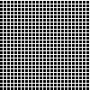
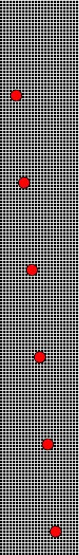
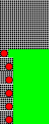
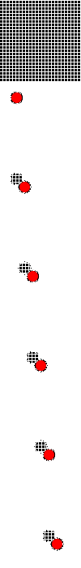
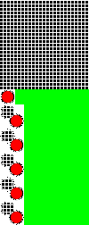

Layers
======

Coalesce Layers
---------------

.. versionadded:: 0.5.0

When *reading* animations that have already been optimized, be sure to
call :meth:`~wand.image.BaseImage.coalesce()` before performing any additional
operations. This is especially important as the :c:type:`MagickWand` internal
iterator state may be pointing to the last frame read into the image stack, and
with optimized images, this is usually a sub-image only holding a frame delta.

>>>  with Image(filename='layers-optmized.gif') as img:
...      img.coalesce()
...      # ... do work ...

Optimizing Layers
-----------------

.. versionadded:: 0.5.0

A few optimization techniques exist when working with animated graphics.
For example, a GIF image would have a rather large file size if every frame
requires the full image to be redrawn. Let's take a look at the effects
of :meth:`~wand.image.BaseImage.optimize_layers()`, and
:meth:`~wand.image.BaseImage.optimize_transparency()`.

To start, we can quickly create an animated gif.

.. code::

    from wand.color import Color
    from wand.image import Image

    with Image(width=100, height=100, pseudo='pattern:crosshatch') as canvas:
        canvas.negate()
        for offset in range(20, 80, 10):
            with canvas.clone() as frame:
                with Drawing() as ctx:
                    ctx.fill_color = Color('red')
                    ctx.stroke_color = Color('black')
                    ctx.circle((offset, offset), (offset+5, offset+5))
                    ctx.draw(frame)
                canvas.sequence.append(frame)
        canvas.save(filename='layers.gif')

Another quick helper method to allow us to view/debug each frame.

.. code::

    def debug_layers(image, output):
        print('Debugging to file', output)
        with Image(image) as img:
            img.background_color = Color('lime')
            for index, frame in enumerate(img.sequence):
                print('Frame {0} size : {1} page: {2}'.format(index,
                                                              frame.size,
                                                              frame.page))
            img.concat(stacked=True)
            img.save(filename=output)

We can debug the previously created :file:`layers.gif` by running the
following:

>>>  with Image(filename='layers.gif') as img:
...      debug_layers(img, 'layers-expanded.png')
Debugging to file layers-expanded.png
Frame 0 size : (100, 100) page: (100, 100, 0, 0)
Frame 1 size : (100, 100) page: (100, 100, 0, 0)
Frame 2 size : (100, 100) page: (100, 100, 0, 0)
Frame 3 size : (100, 100) page: (100, 100, 0, 0)
Frame 4 size : (100, 100) page: (100, 100, 0, 0)
Frame 5 size : (100, 100) page: (100, 100, 0, 0)
Frame 6 size : (100, 100) page: (100, 100, 0, 0)

The moving circle is the only thing that changes between each frame, so we
can optimize by having each frame only contain the delta.

>>>  with Image(filename='layers.gif') as img:
...      img.optimize_layers()
...      debug_layers(img, 'layers-optmized-layers.png')
Debugging to file layers-optmized-layers.png
Frame 0 size : (100, 100) page: (100, 100, 0, 0)
Frame 1 size : (17, 17) page: (100, 100, 12, 12)
Frame 2 size : (26, 27) page: (100, 100, 12, 12)
Frame 3 size : (26, 27) page: (100, 100, 23, 22)
Frame 4 size : (26, 27) page: (100, 100, 32, 32)
Frame 5 size : (26, 27) page: (100, 100, 43, 42)
Frame 6 size : (26, 27) page: (100, 100, 52, 52)

Notice each frame after the first has a reduce size & page x/y offset.
Contacting each frame shows only the minimum bounding region covering the pixel
changes across each previous frame. *Note: the lime-green background is only
there for a visual cue one the website, and has not special meaning outside of
"no-data here."*

Optimizing Transparency
-----------------------

.. versionadded:: 0.5.0

Following the above examples, we can also optimize by forcing pixels transparent
if they are unchanged since the previous frame.

>>>  with Image(filename='layers.gif') as img:
...    img.optimize_transparency()
...    debug_layers(img, 'layers-optmized-transparent.png')
Debugging to file layers-optmized-transparent.png
Frame 0 size : (100, 100) page: (100, 100, 0, 0)
Frame 1 size : (100, 100) page: (100, 100, 0, 0)
Frame 2 size : (100, 100) page: (100, 100, 0, 0)
Frame 3 size : (100, 100) page: (100, 100, 0, 0)
Frame 4 size : (100, 100) page: (100, 100, 0, 0)
Frame 5 size : (100, 100) page: (100, 100, 0, 0)
Frame 6 size : (100, 100) page: (100, 100, 0, 0)

Notice both the size of each frame, and the page offset are unchanged. This
technique only really saves if the subject already contains transparency color
channels, and so most modern gif animations would not benefit from this method.

Naturally, applying both layer & transparency optimization will demonstrate
both effects.

>>>  with Image(filename='layers.gif') as img:
...      img.optimize_layers()
...      img.optimize_transparency()
...      debug_layers(img, 'layers-optmized-layers-transparent.png')
Debugging to file layers-optmized-layers-transparent.png
Frame 0 size : (100, 100) page: (100, 100, 0, 0)
Frame 1 size : (17, 17) page: (100, 100, 12, 12)
Frame 2 size : (26, 27) page: (100, 100, 12, 12)
Frame 3 size : (26, 27) page: (100, 100, 23, 22)
Frame 4 size : (26, 27) page: (100, 100, 32, 32)
Frame 5 size : (26, 27) page: (100, 100, 43, 42)
Frame 6 size : (26, 27) page: (100, 100, 52, 52)

*Note: Lime-green background added for visibility cue.*