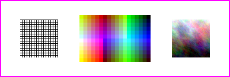
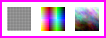
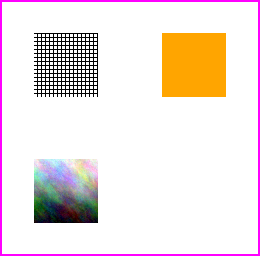
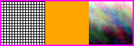
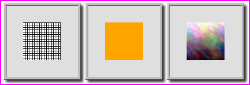
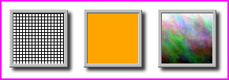
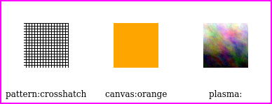
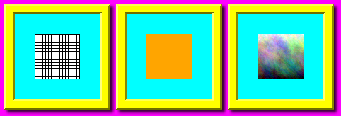

Montage
=======

.. versionadded:: 0.6.8

The :meth:`Image.montage() <wand.image.Image.montage>` method iterates over
each image loaded on the stack, and generates a new image containing thumbnails
for appending together. Similar to a contact sheets used by film photography.

.. code-block:: python

    from wand.image import Image

    with Image() as img:
        for src in ['pattern:crosshatch', 'netscape:', 'plasma:']:
            with Image(width=64, height=64, pseudo=src) as item:
                img.image_add(item)
        img.montage()
        img.border('magenta', 2, 2)
        img.save(filename='montage-default.png')

.. _montage-thumbnail-size:

Thumbnail Size
--------------

We can control the size of the thumbnail, and the padding between with the
``thumbnail=`` key-word argument. The value of this argument is a geometry
string following the format::
    
    {WIDTH}x{HEIGHT}+{X}+{Y}

For example:

.. code-block:: python

    from wand.image import Image

    with Image() as img:
        for src in ['pattern:crosshatch', 'netscape:', 'plasma:']:
            with Image(width=64, height=64, pseudo=src) as item:
                img.image_add(item)
        img.montage(thumbnail="24x24!+5+5")
        img.border('magenta', 2, 2)
        img.save(filename='montage-thumbnail.png')

.. note::

    Thumbnail geometry modifiers are supported.

    +------+----------------------------+
    | flag | Description                |
    +------+----------------------------+
    | !    | Ignore aspect.             |
    +------+----------------------------+
    | >    | Only shrink larger images. |
    +------+----------------------------+
    | <    | Only enlarge small images. |
    +------+----------------------------+
    | ^    | Fill area.                 |
    +------+----------------------------+
    | %    | Use percent value.         |
    +------+----------------------------+
    | @    | Use pixel count.           |
    +------+----------------------------+

.. _montage-tile-layout:

Tile Layout
-----------

.. versionadded:: 0.6.8

The number of images per row & column can be controlled by setting the
``tile=`` key-word argument. This argument's value follows the geometry format::

    {COLUMNS}x{ROWS}

For example:

.. code-block:: python

    from wand.image import Image

    with Image() as img:
        for src in ['pattern:crosshatch', 'canvas:orange', 'plasma:']:
            with Image(width=64, height=64, pseudo=src) as item:
                img.image_add(item)
        img.montage(tile='2x2')
        img.border('magenta', 2, 2)
        img.save(filename='montage-tile.png')

.. _montage-concatenation-mode:

Concatenation Mode
------------------

Use the ``mode="concatenate"`` keyword argument to eliminate extra whitespace
between image thumbnails.  For example:

.. code-block:: python

    from wand.image import Image

    with Image() as img:
        for src in ['pattern:crosshatch', 'canvas:orange', 'plasma:']:
            with Image(width=64, height=64, pseudo=src) as item:
                img.image_add(item)
        img.montage(mode='concatenate')
        img.border('magenta', 2, 2)
        img.save(filename='montage-concatenate.png')

.. _montage-frame-mode:

Frame Mode
----------

To draw a decorative frame around each thumbnail, use a combination of
``mode="frame"`` and ``frame=geometry`` key-words.

.. code-block:: python

    from wand.image import Image

    with Image() as img:
        for src in ['pattern:crosshatch', 'canvas:orange', 'plasma:']:
            with Image(width=64, height=64, pseudo=src) as item:
                img.image_add(item)
        img.montage(mode='frame', frame='5')
        img.border('magenta', 2, 2)
        img.save(filename='montage-frame.png')

Define the ``thumbnail=`` key-word to control the border between the thumbnail,
and frame.

.. code-block:: python

    img.montage(mode='frame', frame='5', thumbnail="64x64+10+10")

.. _montage-labels:

Labels
------

The montage method will apply a text label under the thumbnail if the source
image contains an ImageMagick label attribute. You can style the typeface of
the label's text by passing :class:`~wand.font.Font` instance to the
``font=`` key-word.

For example:

.. code-block:: python

    from wand.font import Font
    from wand.image import Image

    with Image() as img:
        for src in ['pattern:crosshatch', 'canvas:orange', 'plasma:']:
            with Image() as item:
                # NOTE: Set the label before reading the image.
                item.options['label'] = src
                item.pseudo(64, 64, src)
                img.image_add(item)
        style = Font("DejaVuSerif.ttf", 12, 'black')
        img.montage(font=style)
        img.border('magenta', 2, 2)
        img.save(filename='montage-concatenate.png')

.. _montage-colors:

Colors
------

You can apply colors to each component within the montage image.
The overall background can be defined by setting
:attr:`~wand.image.BaseImage.background_color` attribute on the base image,
and :attr:`~wand.image.BaseImage.matte_color` &
:attr:`~wand.image.BaseImage.border_color` on each thumbnail's source image.

For example:

.. code-block:: python

    from wand.image import Image

    with Image() as img:
        for src in ['pattern:crosshatch', 'canvas:orange', 'plasma:']:
            with Image(width=64, height=64, pseudo=src) as item:
                item.border_color = 'cyan'   # Inner Frame
                item.matte_color = 'yellow'  # Outer Frame
                img.image_add(item)
        img.background_color = 'magenta'     # Canvas background
        img.montage(font=style)
        img.save(filename='montage-color.png')

