Morphology
==========

Morphology modifies an image by evaluating the pixel values surrounding each
pixel. The basic Wand method signature is::

    img.morphology(method, kernel, iterations)

Where ``method`` is the operation to apply, and is defined by
:const:`~wand.image.MORPHOLOGY_METHODS`. The ``kernel`` can include predefined
built-in shapes, or user-defined shapes.

Shapes
------

Shapes, also known as "kernels", are small matrices that control morphology
method operations. The kernels define the size, and targeted pixels to modify.

To demonstrate a kernel's shape; let's generate a simple black canvas around
a white pixel.

.. code-block:: python

    from wand.image import Image

    with Image(width=1, height=1, pseudo='xc:white') as img:
        img.border('black', 6, 6, compose='copy')
        img.save(filename='morph-dot.png')

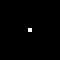

Built-In Kernels
''''''''''''''''

ImageMagick contains about three dozen pre-built kernels that cover most common
morphology uses, as well as a few specific ones leveraged for internal
operations. To use built-in kernels, the following string format is required.

.. parsed-literal::

    label[:arg1,arg2,arg3,..]

Where `label` is a string defined in :const:`~wand.image.KERNEL_INFO_TYPES`.
Each label can have additional optional arguments, which are defined
by a comma separated list of doubles. A colon ``':'`` symbol should separate
the label & argument list. For example:

.. parsed-literal::

    disk:2.5,3,5

Below is a small list of examples for the most common kernel shapes.

Cross
"""""

.. code-block:: python

    with Image(filename='morph-dot.png') as img:
        img.morphology(method='dilate', kernel='cross:3')
        img.sample(width=60, height=60)
        img.save(filename='morph-kernel-cross3.png')

Diamond
"""""""

.. code-block:: python

    with Image(filename='morph-dot.png') as img:
        img.morphology(method='dilate', kernel='diamond:3')
        img.sample(width=60, height=60)
        img.save(filename='morph-kernel-diamond3.png')

Disk
""""

.. code-block:: python

    with Image(filename='morph-dot.png') as img:
        img.morphology(method='dilate', kernel='disk:5')
        img.sample(width=60, height=60)
        img.save(filename='morph-kernel-disk5.png')

Octagon
"""""""
.. code-block:: python

    with Image(filename='morph-dot.png') as img:
        img.morphology(method='dilate', kernel='octagon:5')
        img.sample(width=60, height=60)
        img.save(filename='morph-kernel-octagon5.png')

Plus
""""

.. code-block:: python

    with Image(filename='morph-dot.png') as img:
        img.morphology(method='dilate', kernel='plus:3')
        img.sample(width=60, height=60)
        img.save(filename='morph-kernel-plus3.png')

Ring
""""

.. code-block:: python

    with Image(filename='morph-dot.png') as img:
        img.morphology(method='dilate', kernel='ring:5,4')
        img.sample(width=60, height=60)
        img.save(filename='morph-kernel-ring5.png')

Square
""""""

.. code-block:: python

    with Image(filename='morph-dot.png') as img:
        img.morphology(method='dilate', kernel='square:3')
        img.sample(width=60, height=60)
        img.save(filename='morph-kernel-square3.png')

Custom Kernels
''''''''''''''

Users can define their own kernel shape by building a string that follows
the format:

.. parsed-literal::

    geometry:pix1,pix2,pix3,...

Where geometry is defined as `WIDTHxHEIGHT` of the kernel, followed by a colon,
and then a comma separated list of float values. For
example:

.. code-block:: python

    custom_kernel = """
    5x5:
        -,-,1,-,-
        -,1,1,1,-
        -,-,-,-,-
        -,1,-,1,-
        1,1,1,1,1
    """

    with Image(filename='morph-dot.png') as img:
        img.morphology(method='dilate', kernel=custom_kernel)
        img.sample(width=60, height=60)
        img.save(filename='morph-kernel-custom.png')

By default, the kernel's "origin" is calculated to be at the center of the
kernel. Users can set the kernel origin by defining `±X±Y` as part of the
geometry. For example::

    top_left_origin = """
    3x3+0+0:
        1,1,-
        1,0,0
        -,0,-
    """

    bottom_right_origin = """
    3x3+2+2:
        1,1,-
        1,0,0
        -,0,-
    """

Methods
-------

Morphology methods are broken into three general groups. Basic methods (such as
`Erode`_, `Dilate`_, `Open`_, & `Close`_) are used to increase or reduce
foreground shapes. Difference methods (such as `Edge In`_, `Edge Out`_,
`Top Hat`_ & `Bottom Hat`_) draw pixels around foreground edges. Pattern
matching methods (such as `Hit and Miss`_, `Thinning`_ & `Thicken`_) add pixels
when a kernel is matched.

Morphology is intended for images with a black background, and a white
foreground. To demonstrate morphology methods, let's create a basic binary
image. We can quickly generate a `PBM` image from bytes-string literal.

.. code-block:: python

    pbm = b"""P1
    10 10
    1 1 1 1 1 1 1 1 1 1
    1 1 0 1 1 0 0 0 0 1
    1 0 0 0 1 0 0 1 1 1
    1 1 0 1 1 0 0 0 0 1
    1 1 1 1 1 0 0 1 1 1
    1 1 1 1 0 0 0 0 0 1
    1 0 0 0 0 0 0 1 1 1
    1 0 1 0 1 0 1 1 1 1
    1 0 1 0 1 0 1 1 0 1
    1 1 1 1 1 1 1 1 1 1
    """

    with Image(blob=pbm, format="PBM") as img:
        img.sample(100, 100)
        img.save(filename="morph-src.png")

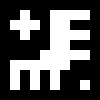

The morphology examples below will all use ``'morph-src.png'`` source image.

Erode
'''''

Erode reduces matching white pixels, and expands black spaces.

.. code-block:: python

    with Image(filename='morph-src.png') as img:
        img.morphology(method='erode', kernel='octagon')
        img.save(filename='morph-erode.png')

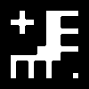

Dilate
''''''

Dilate increases matching white pixels, and reduces black spaces.

.. code-block:: python

    with Image(filename='morph-src.png') as img:
        img.morphology(method='dilate', kernel='octagon')
        img.save(filename='morph-dilate.png')

Open
''''

Open rounds the white edges, but preserves "holes", or black corners.

.. code-block:: python

    with Image(filename='morph-src.png') as img:
        img.morphology(method='open', kernel='octagon')
        img.save(filename='morph-open.png')

Notices the black "inner" corners remain sharp, but the white "outer" corners
are rounded.

Close
'''''

Close rounds the black edges, and removes any "holes".

.. code-block:: python

    with Image(filename='morph-src.png') as img:
        img.morphology(method='close', kernel='octagon')
        img.save(filename='morph-close.png')

Notices the white "outer" corners remain sharp, but the black "inner" corners
are rounded.

Smooth
''''''

Smooth applies both `Open`_ & `Close`_ methods. This will remove small objects
& holes, and smooth both white & black corners.

.. code-block:: python

    with Image(filename='morph-src.png') as img:
        img.morphology(method='smooth', kernel='octagon')
        img.save(filename='morph-smooth.png')

Edge In
'''''''

Edge In method performs a `Erode`_, but only keeps the targeted pixel next
to a shape. This means the edge is drawn just inside the white of a object.

.. code-block:: python

    with Image(filename='morph-src.png') as img:
        img.morphology(method='edgein', kernel='octagon')
        img.save(filename='morph-edgein.png')

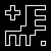

Edge Out
''''''''

Edge Out performs similar to `Edge In`_, but uses the results of `Dilate`_ to
draw a edge border just outside of an object.

.. code-block:: python

    with Image(filename='morph-src.png') as img:
        img.morphology(method='edgeout', kernel='octagon')
        img.save(filename='morph-edgeout.png')

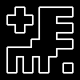

Edge
''''

The Edge method performs both `Erode`_ & `Dilate`_ methods, but only keeps
differences between them as the resulting image. The result is border drawn on
the edge of the objects within the image.

.. code-block:: python

    with Image(filename='morph-src.png') as img:
        img.morphology(method='edge', kernel='octagon')
        img.save(filename='morph-edge.png')

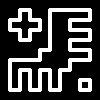

Top Hat
'''''''

The Top Hat method performs the `Open`_ morphology method, but only returns the
pixels matched by the kernel.

.. code-block:: python

    with Image(filename='morph-src.png') as img:
        img.morphology(method='tophat', kernel='octagon')
        img.save(filename='morph-tophat.png')

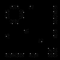

Bottom Hat
''''''''''

The Bottom Hat method performs the `Close`_ morphology method, but only returns
the pixels matched by the kernel.

.. code-block:: python

    with Image(filename='morph-src.png') as img:
        img.morphology(method='bottom_hat', kernel='octagon')
        img.save(filename='morph-bottom_hat.png')

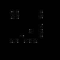

Hit and Miss
''''''''''''

The hit-and-miss (a.k.a. HMT) method will remove all pixels from the image,
unless a kernel pattern is matched; in which case, the pixel under the matched
kernel will be set to white.

.. code-block:: python

    with Image(filename='morph-src.png') as img:
        corners = """
        3x3:
            1,1,-
            1,0,0
            -,0,-
        """
        img.morphology(method='hit_and_miss', kernel=corners)
        img.save(filename='morph-hit_and_miss.png')

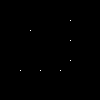

Thinning
''''''''

The thinning method removes a pixel when the kernel matches neighboring pixels.
When using custom kernels, you can control which pixel should be targeted
by setting the X/Y offset of the kernel's geometry.

.. code-block:: python

    with Image(filename='morph-src.png') as img:
        img.morphology(method='thinning',
                       kernel='3x1-0-0:1,1,0',
                       iterations=3)
        img.save(filename='morph-thinning.png')

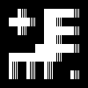

There's also a special ``'skeleton'`` built-in kernel, paired with `-1`
iterations to continue to reduce all pixels down to a minimum line.

.. code-block:: python

    with Image(filename='morph-src.png') as img:
        img.morphology(method='thinning',
                       kernel='skeleton',
                       iterations=-1)
        img.save(filename='morph-thinning-skeleton.png')

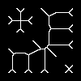

Thicken
'''''''

The thicken method adds a pixel whenever a kernel matches neighboring pixels.
You can control the targeted pixel by defining the offset geometry on custom
kernels.

.. code-block:: python

    with Image(filename='morph-src.png') as img:
        K = """
        3x3+0+0:
            0,-,-
            -,0,-
            -,-,1
        """
        img.morphology(method='thicken',
                       kernel=K,
                       iterations=4)
        img.save(filename='morph-thicken.png')

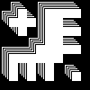

Distance
''''''''

Distance method is a unique, and very special morphology. Given a binary
black & white image, each white pixel will be replace with a color value
corresponding to the distance to the nearest edge.

.. code-block:: python

    with Image(filename='morph-src.png') as img:
        img.morphology(method='distance',
                       kernel='euclidean',
                       iterations=4)
        img.save(filename='morph-distance-raw.png')

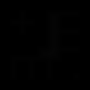

The resulting image is not that special. The pixel values are so low that they
appear black. However, if we use :meth:`~wand.image.BaseImage.auto_level()`
method, we should be able to shift the values across the full grayscale.

.. code-block:: python

    with Image(filename='morph-src.png') as img:
        img.morphology(method='distance',
                       kernel='euclidean',
                       iterations=4)
        img.auto_level()
        img.save(filename='morph-distance-auto.png')

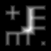

Other kernels used for distance morphology are ``'chebyshev'``, ``'manhattan'``,
``'octagonal'``, and ``'euclidean'``. The basic kernel string format is:

.. parsed-literal::

    distance_kernel[:radius[,scale]]

For example:

.. parsed-literal::

    manhattan:5,400
