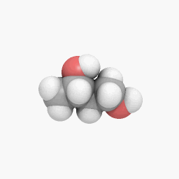
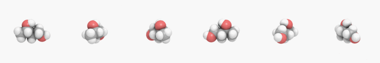

Sequence
========

.. note::

   The image :file:`sequence-animation.gif` used in this docs
   has been released into the public domain by its author,
   C6541_ at Wikipedia_ project.  This applies worldwide.  (Source_)

   .. _C6541: http://en.wikipedia.org/wiki/User:C6541
   .. _Wikipedia: http://en.wikipedia.org/wiki/
   .. _Source: http://commons.wikimedia.org/wiki/File:1.3-B.gif

.. versionadded:: 0.3.0

Some images may actually consist of two or more images.  For example,
animated :mimetype:`image/gif` images consist of multiple frames.
Some :mimetype:`image/ico` images have different sizes of icons.

For example, the above image :file:`sequence-animation.gif` consists
of the following frames (actually it has 60 frames, but we sample only
few frames to show here):

:attr:`~wand.image.BaseImage.sequence` is a :class:`~collections.Sequence`
--------------------------------------------------------------------------

If we :doc:`open <read>` this image, :class:`~wand.image.Image` object
has :attr:`~wand.image.BaseImage.sequence`.  It's a list-like object
that maintain its all frames.

For example, :func:`len()` for this returns the number of frames:

>>> from wand.image import Image
>>> with Image(filename='sequence-animation.gif') as image:
...     len(image.sequence)
...
60

You can get an item by index from :attr:`~wand.image.BaseImage.sequence`:

>>> with Image(filename='sequence-animation.gif') as image:
...     image.sequence[0]
...
<wand.sequence.SingleImage: ed84c1b (256x256)>

Or slice it:

>>> with Image(filename='sequence-animation.gif') as image:
...     image.sequence[5:10]
...
[<wand.sequence.SingleImage: 0f49491 (256x256)>,
 <wand.sequence.SingleImage: 8eba0a5 (256x256)>,
 <wand.sequence.SingleImage: 98c10fa (256x256)>,
 <wand.sequence.SingleImage: b893194 (256x256)>,
 <wand.sequence.SingleImage: 181ce21 (256x256)>]

:attr:`~wand.image.Image` versus :attr:`~wand.sequence.SingleImage`
-------------------------------------------------------------------

Note that each item of :attr:`~wand.image.BaseImage.sequence` is a
:class:`~wand.sequence.SingleImage` instance, not :class:`~wand.image.Image`.

:class:`~wand.image.Image` is a container that directly represents
*image files* like :file:`sequence-animation.gif`, and
:class:`~wand.sequence.SingleImage` is a single image that represents
*frames* in animations or *sizes* in :mimetype:`image/ico` files.

They both inherit :class:`~wand.image.BaseImage`, the common abstract class.
They share the most of available operations and properties like
:meth:`~wand.image.BaseImage.resize()` and :attr:`~wand.image.BaseImage.size`,
but some are not.  For example, :meth:`~wand.image.Image.save()` and
:attr:`~wand.image.Image.mimetype` are only provided by
:class:`~wand.image.Image`.  :attr:`~wand.sequence.SingleImage.delay` and
:attr:`~wand.sequence.SingleImage.index` are only available for
:class:`~wand.sequence.SingleImage`.

In most cases, images don't have multiple images, so it's okay if you think
that :class:`~wand.image.Image` and :class:`~wand.sequence.SingleImage` are
the same, but be careful when you deal with animated :mimetype:`image/gif`
files or :mimetype:`image/ico` files that contain multiple icons.
