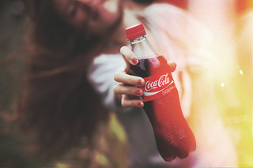
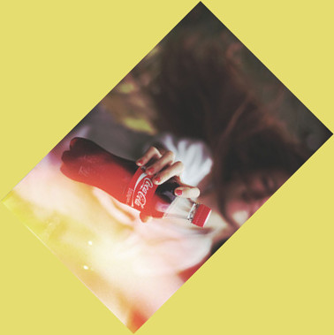
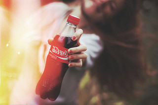
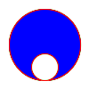

Transformation
==============

.. note::

   The image :file:`transform.jpg` used in this docs is taken by
   `Megan Trace`__, and licensed under `CC BY-NC 2.0`__.
   It can be found the `original photography from Flickr`__.

   __ http://megantracephoto.tumblr.com/
   __ http://creativecommons.org/licenses/by-nc/2.0/deed.en
   __ http://www.flickr.com/photos/megantrace/6234830561/

Rotation
--------

.. versionadded:: 0.1.8

:class:`~wand.image.Image` object provides a simple method to rotate images:
:meth:`~wand.image.BaseImage.rotate()`.  It takes a ``degree`` which can be 0
to 359.  (Actually you can pass 360, 361, or more but it will be the same to
0, 1, or more respectively.)

For example, where the given image :file:`transform.jpg`:

The below code makes the image rotated 90° to right::

    from wand.image import Image

    with Image(filename='transform.jpg') as image:
        with image.clone() as rotated:
            rotated.rotate(90)
            rotated.save(filename='transform-rotated-90.jpg')

The generated image :file:`transform-rotated-90.jpg` looks like:

If ``degree`` is not multiples of 90, the optional parameter ``background``
will help (its default is transparent)::

    from wand.color import Color
    from wand.image import Image

    with Image(filename='transform.jpg') as image:
        with image.clone() as rotated:
            rotated.rotate(135, background=Color('rgb(229,221,112)'))
            rotated.save(filename='transform-rotated-135.jpg')

The generated image :file:`transform-rotated-135.jpg` looks like:

Flip and flop
-------------

.. versionadded:: 0.3.0

You can make a mirror image by reflecting the pixels around the central
x- or y-axis.  For example, where the given image :file:`transform.jpg`:

The following code flips the image using :meth:`Image.flip()
<wand.image.BaseImage.flip>` method::

    from wand.image import Image

    with Image(filename='transform.jpg') as image:
        with image.clone() as flipped:
            flipped.flip()
            flipped.save(filename='transform-flipped.jpg')

The image :file:`transform-flipped.jpg` generated by the above code looks like:

As like :meth:`~wand.image.BaseImage.flip()`,
:meth:`~wand.image.BaseImage.flop()` does the same thing except it doesn't
make a vertical mirror image but horizontal::

    from wand.image import Image

    with Image(filename='transform.jpg') as image:
        with image.clone() as flopped:
            flopped.flop()
            flopped.save(filename='transform-flopped.jpg')

The image :file:`transform-flopped.jpg` generated by the above code looks like:

Chroma Key with FX Expressions
------------------------------

.. versionadded:: 0.4.1

The :meth:`Image.fx() <wand.image.BaseImage.fx>` method is a powerful
tool for evaluating an image's pixel data, and creating an image mask.
Green screen, or Chroma-key compositing, is a common post-production
task for manipulating image data, and can be done with FX expressions.

A transparent mask can be calculated by applying the following
expression::

    alpha(red, green, blue) = K1 * blue - K2 * green + K3

Where ``K1``, ``K2`` & ``K3`` are user-defined constants.

.. image:: ../_images/chroma-key.png
   :alt: chroma-key.png

This example will assume the value of ``1.0`` for each constant, as the *lime*
color will be keyed.::

    from wand.image import Image

    with Image(filename='chroma.png') as image:
        expression = '{k1} * b - {k2} * g + {k3}'.format(k1=1.0,
                                                         k2=1.0,
                                                         k3=1.0)
        with image.fx(expression) as mask:
            image.composite_channel(channel='alpha',
                                    operator='copy_opacity',
                                    image=mask)

