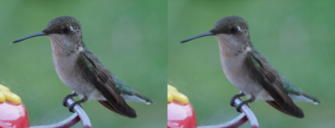
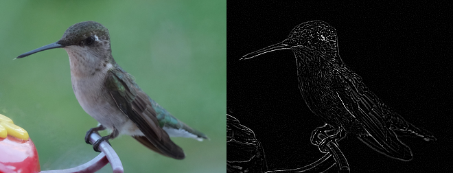
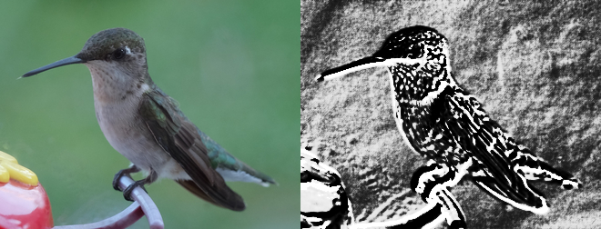
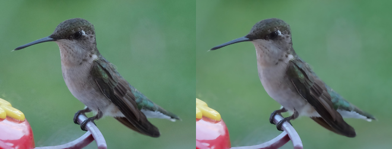
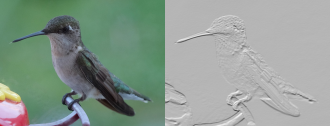

Transformation
==============

.. note::

   The image :file:`transform.jpg` used in this docs is taken by
   `Megan Trace`__, and licensed under `CC BY-NC 2.0`__.
   It can be found the `original photography from Flickr`__.

   __ http://megantracephoto.tumblr.com/
   __ http://creativecommons.org/licenses/by-nc/2.0/deed.en
   __ http://www.flickr.com/photos/megantrace/6234830561/

.. _despeckle:

Despeckle
---------

.. versionadded:: 0.5.0

Despeckling is one of the many techniques you can use to reduce noise on a
given image. Also see :ref:`enhance`.

.. code::

    from wand.image import Image

    with Image(filename="hummingbird.jpg") as left:
        with left.clone() as right:
            right.despeckle()
            left.extent(width=left.width*2)
            left.composite(right, top=0, left=right.width)
        left.save(filename="hummingbird-despeckle.jpg")

.. _edge:

Edge
----

.. versionadded:: 0.5.0

Detects edges on black and white images with a simple convolution filter. If
used with a color image, the transformation will be applied to each
color-channel.

.. code::

    from wand.image import Image

    with Image(filename="hummingbird.jpg") as left:
        with left.clone() as right:
            right.transform_colorspace('gray')
            right.edge(1)
            left.extent(width=left.width*2)
            left.composite(right, top=0, left=right.width)
        left.save(filename="hummingbird-edge.jpg")

.. _emboss:

Emboss
-------

.. versionadded:: 0.5.0

Generates a 3D effect that can be described as print reliefs. Like :ref:`edge`,
best results can be generated with grayscale image. Also see :ref:`shade`.

.. code::

    from wand.image import Image

    with Image(filename="hummingbird.jpg") as left:
        with left.clone() as right:
            right.transform_colorspace('gray')
            right.emboss(radius=3.0, sigma=1.75)
            left.extent(width=left.width*2)
            left.composite(right, top=0, left=right.width)
        left.save(filename="hummingbird-emboss.jpg")

.. _enhance:

Enhance
-------

.. versionadded:: 0.5.0

Reduce the noise of an image by applying an auto-filter. Also see
:ref:`despeckle`.

.. code::

    from wand.image import Image

    with Image(filename="hummingbird.jpg") as left:
        with left.clone() as right:
            right.enhance()
            left.extent(width=left.width*2)
            left.composite(right, top=0, left=right.width)
        left.save(filename="hummingbird-enhance.jpg")

.. _flip_flop:

Flip and flop
-------------

.. versionadded:: 0.3.0

You can make a mirror image by reflecting the pixels around the central
x- or y-axis.  For example, where the given image :file:`transform.jpg`:

.. image:: ../_images/transform.jpg
   :alt: transform.jpg

The following code flips the image using :meth:`Image.flip()
<wand.image.BaseImage.flip>` method::

    from wand.image import Image

    with Image(filename='transform.jpg') as image:
        with image.clone() as flipped:
            flipped.flip()
            flipped.save(filename='transform-flipped.jpg')

The image :file:`transform-flipped.jpg` generated by the above code looks like:

.. image:: ../_images/transform-flipped.jpg
   :alt: transform-flipped.jpg

As like :meth:`~wand.image.BaseImage.flip()`,
:meth:`~wand.image.BaseImage.flop()` does the same thing except it doesn't
make a vertical mirror image but horizontal::

    from wand.image import Image

    with Image(filename='transform.jpg') as image:
        with image.clone() as flopped:
            flopped.flop()
            flopped.save(filename='transform-flopped.jpg')

The image :file:`transform-flopped.jpg` generated by the above code looks like:

.. image:: ../_images/transform-flopped.jpg
   :alt: transform-flopped.jpg

Rotation
--------

.. versionadded:: 0.1.8

:class:`~wand.image.Image` object provides a simple method to rotate images:
:meth:`~wand.image.BaseImage.rotate()`.  It takes a ``degree`` which can be 0
to 359.  (Actually you can pass 360, 361, or more but it will be the same to
0, 1, or more respectively.)

For example, where the given image :file:`transform.jpg`:

.. image:: ../_images/transform.jpg
   :alt: transform.jpg

The below code makes the image rotated 90° to right::

    from wand.image import Image

    with Image(filename='transform.jpg') as image:
        with image.clone() as rotated:
            rotated.rotate(90)
            rotated.save(filename='transform-rotated-90.jpg')

The generated image :file:`transform-rotated-90.jpg` looks like:

.. image:: ../_images/transform-rotated-90.jpg
   :alt: transform-rotated-90.jpg

If ``degree`` is not multiples of 90, the optional parameter ``background``
will help (its default is transparent)::

    from wand.color import Color
    from wand.image import Image

    with Image(filename='transform.jpg') as image:
        with image.clone() as rotated:
            rotated.rotate(135, background=Color('rgb(229,221,112)'))
            rotated.save(filename='transform-rotated-135.jpg')

The generated image :file:`transform-rotated-135.jpg` looks like:

.. image:: ../_images/transform-rotated-135.jpg
   :alt: transform-rotated-135.jpg

.. _shade:

Shade
-----

.. versionadded:: 0.5.0

Creates a 3D effect by simulating light from source where ``aziumth`` controls
the X/Y angle, and ``elevation`` controls the Z angle. You can also determine
of the resulting image should be transformed to grayscale by passing ``gray``
boolean.

.. code::

    from wand.image import Image

    with Image(filename="hummingbird.jpg") as left:
        with left.clone() as right:
            right.shade(gray=True,
                        azimuth=286.0,
                        elevation=45.0)
            left.extent(width=left.width*2)
            left.composite(right, top=0, left=right.width)
        left.save(filename="hummingbird-shade.jpg")

