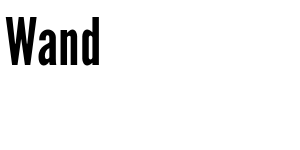
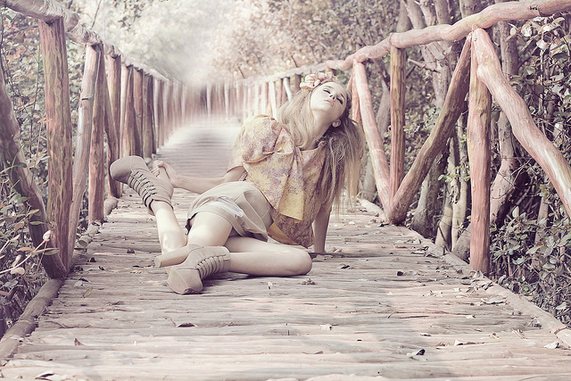
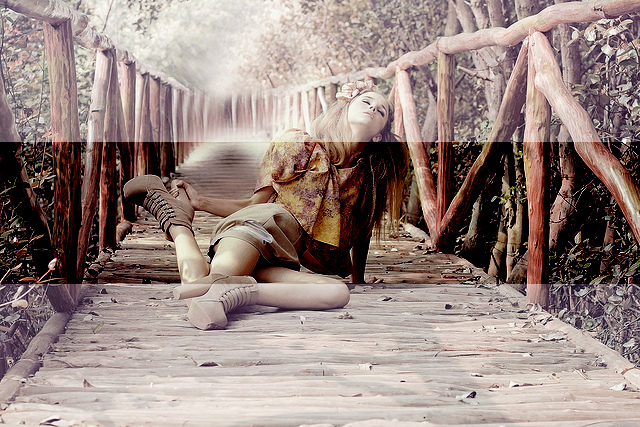

:orphan:

What's new in Wand 0.3?
=======================

This guide doesn't cover all changes in 0.3.  See also the full list of
changes in :ref:`changelog-0.3.0`.

Python 3 support
----------------

Wand finally becomes to support Python 3, the future of Python.  It actually
doesn't cover all Python 3 versions, but the most two recent versions, 3.2 and
3.3, are supported.  We still support Python 2.6, 2.7, and PyPy as well,
so there's no dropped compatibility.

.. seealso::

   `Wand now works on Python 3.2 and 3.3`__
      The announcement about this on the mailing list.

__ http://librelist.com/browser/wand/2013/6/6/wand-now-works-on-python-3-2-and-3-3/

Sequence
--------

Wand now adds supports to sequential images like animated :mimetype:`image/gif`
images and :mimetype:`image/ico` images that contains multiple icons.
To distinguish between each single image and the container image,
newly introduced class :class:`~wand.sequence.SingleImage` has been added.
The most of operations and properties are commonly available for both types,
:class:`~wand.image.Image` and :class:`~wand.sequence.SingleImage`, and these
are defined by their common superclass, :class:`~wand.image.BaseImage`.

So every :class:`~wand.image.Image` object now has :attr:`sequence
<wand.image.BaseImage.sequence>` attribute which is list-like.  It implements
:class:`collections.MutableSequence` protocol.  That means you can pass it
into :keyword:`for` statement, get an item by index from it, slice it,
call :func:`len()` for it, or :keyword:`del` an item of it by index.  Every item
inside it is a :class:`~wand.sequence.SingleImage` instance.

The following example shows you how to determine the largest icon in
a :mimetype:`image/ico` file:

>>> from wand.image import Image
>>> import urllib2
>>> with Image(file=urllib2.urlopen('https://github.com/favicon.ico')) as ico:
...     max(ico.sequence, key=lambda i: i.width * i.height)
...
<wand.sequence.SingleImage: 80d158d (32x32)>

This feature was initially proposed by Michael Elovskikh (:issue:`34`),
and then he also did initial work on this (:issue:`39`).  Andrey Antukh
then improved its API (:issue:`66`).  Bear Dong and Taeho Kim did additional
efforts for issues related to animated :mimetype:`image/gif` images
(:issue:`88`, :issue:`103`, :issue:`112`).

See also the guide for sequence as well: :doc:`../guide/sequence`.

Drawing
-------

Wand 0.3 provides basic facilities to draw :ref:`draw-lines` or
:ref:`draw-texts`.

The following example code writes "Wand" to the transparent background
using :meth:`~wand.image.BaseImage.caption()` method:

>>> from wand.font import Font
>>> font = Font(path='tests/assets/League_Gothic.otf', size=64)
>>> with Image(width=300, height=150) as image:
...     image.caption('Wand', left=5, top=5, width=490, height=140, font=font)
...     image.save(filename='caption-result.png')
...

Adrian Jung and did the most of work for this (:issue:`64`).
Cha, Hojeong added higher-level APIs on this and more text drawing APIs
(:issue:`69`, :issue:`71`, :issue:`74`).

EXIF
----

Wand now can read EXIF metadata from images through :attr:`metadata
<wand.image.Image>` property which is a mapping:

>>> from __future__ import print_function
>>> url = 'http://farm9.staticflickr.com/8282/7874109806_3fe0080ae4_o_d.jpg'
>>> with Image(file=urllib2.urlopen(url)) as i:
...     for key, value in i.metadata.items():
...         if key.startswith('exif:'):
...             print(key, value)
...
exif:ApertureValue 8/1
exif:CustomRendered 0
exif:DateTime 2012:08:27 18:42:15
exif:DateTimeDigitized 2012:08:17 02:33:36
exif:DateTimeOriginal 2012:08:17 02:33:36
exif:ExifOffset 204
exif:ExifVersion 48, 50, 50, 49
exif:ExposureBiasValue 0/1
exif:ExposureMode 1
exif:ExposureProgram 1
exif:ExposureTime 1/50
...

Thanks for Michael Elovskikh who worked on this (:issue:`25`, :issue:`56`).

See also the guide for this as well: :doc:`../guide/exif`.

Seam carving
------------

ImageMagick optionally provides `seam carving`_ (also known as liquid rescaling
or content-aware resizing) through :c:func:`MagickLiquidRescaleImage()`
function if it's properly configured ``--with-lqr``.  It makes you able to
magically resize images without distortion.

Wand 0.3 becomes to provide a simple method :meth:`Image.liquid_rescale()
<wand.image.Image.liquid_rescale>` which binds this API.

You can find more detail examples in its guide: :ref:`seam-carving`.

.. _seam carving: http://en.wikipedia.org/wiki/Seam_carving

Channels
--------

Some channel-related APIs like :attr:`wand.image.Image.channel_images`,
:attr:`~wand.image.Image.channel_depths`, and
:meth:`~wand.image.BaseImage.composite_channel()` are added in Wand 0.3.

The following example makes the overlayed image (second,
:file:`composite-channel-result.jpg`) from the original image (first,
:file:`composite-channel.jpg`):

::

    import shutil
    import urllib2

    from wand.image import Image
    from wand.color import Color

    url = 'http://farm6.staticflickr.com/5271/5836279075_c3f8226bc1_z.jpg'
    with open('composite-channel.jpg', 'wb') as f:
        u = urllib2.urlopen(url)
        shutil.copyfileobj(u, f)
        u.close()

    with Image(filename='composite-channel.jpg') as image:
        with Image(background=Color('black'),
                   width=image.width,
                   height=image.height / 3) as bar:
            image.composite_channel(
                channel='all_channels',
                image=bar,
                operator='overlay',
                left=0,
                top=(image.height- bar.height) / 2
            )
        image.save(filename='composite-channel-result.jpg')

.. note::

   The image :file:`composite-channel.jpg` used in the above example
   is taken by `Ejja Pahlevi`_ and licensed under `CC-BY-2.0`_.
   It can be found the `original photography from Flickr`__.

   .. _Ejja Pahlevi: http://saturatedhigh.tumblr.com/
   .. _CC-BY-2.0: http://creativecommons.org/licenses/by/2.0/
   __ http://www.flickr.com/photos/61808613@N06/5836279075/

Histogram
---------

Every image now has :attr:`~wand.image.BaseImage.histogram` attribute,
which is dictionary-like.  Its keys are colors that used once or more in
the image, and values are are the numbers of the pixels.

For example, simply get :meth:`~wand.image.HistogramDict.keys()` of
:attr:`~wand.image.BaseImage.histogram` if you need its palette.

>>> url = 'http://farm7.staticflickr.com/6145/5982384872_cb1e01004e_n.jpg'
>>> with Image(file=urllib2.urlopen(url)) as image:
...     palette = image.histogram.keys()
